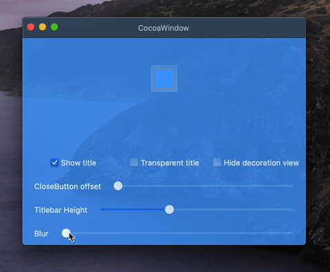
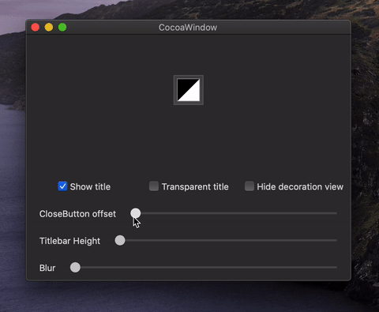
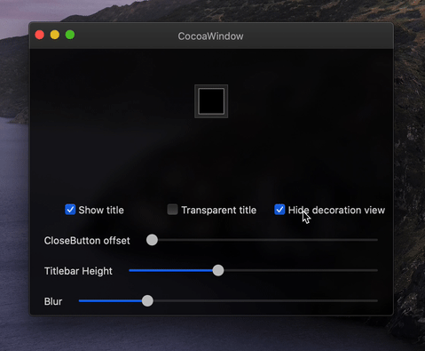
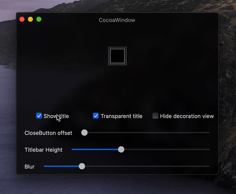
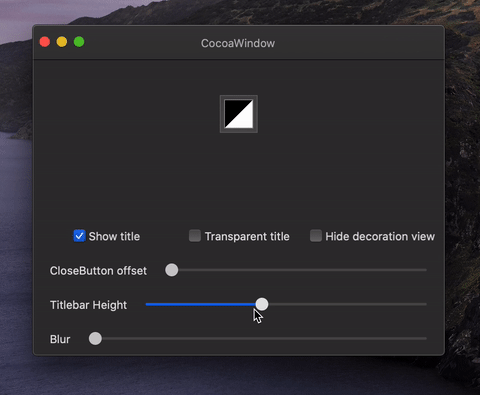
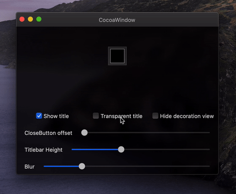

# CocoaWindow

Make NSWindow great again ✨

## Overview

| Feature | Screenshot |
|---|---|
| Realtime blur background |  |
| Close button offset |  |
| Hide decoration view |  |
| Show title bar |  |
| Title bar height |  |
| Transparent title bar |  |

## Requirements

- macOS 10.11+
- Xcode 10+

## Usage

```objc
window.opaque = NO; // Require setting
window.cw_isDecorationViewHidden = YES;
window.cw_blur = 30.0;                                              // Default is 0.0
window.cw_titlebarHeight = 48.0;                                    // Default is 0.0
window.cw_closeButtonOffset = 12.0;                                 // Default is 0.0
```

## Installation

### CocoaPods

CocoaPods is a dependency manager for Cocoa projects. For usage and installation instructions, visit their website. To integrate CocoaWindow into your Xcode project using CocoaPods, specify it in your Podfile:

```ruby
pod 'CocoaWindow'
```

### Manually

If you prefer not to use any of the aforementioned dependency managers, you can integrate CocoaWindow into your project manually.

## License

The [MIT](LICENSE) License.
